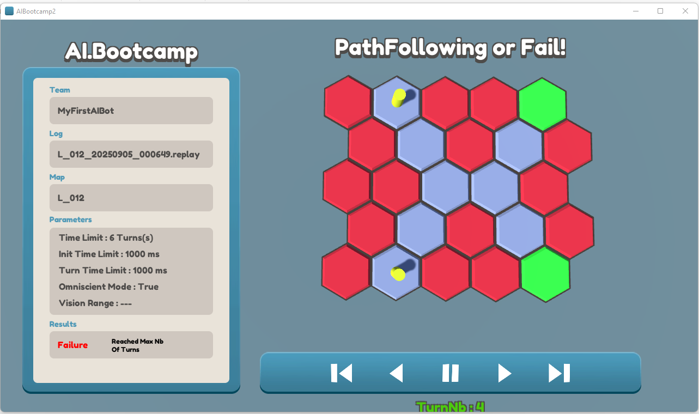

# AIBootcamp

## What is AIBootcamp?
[AIBootcamp](https://sites.google.com/view/aibootcamp/home) is a programming challenge created by [Carle Coté](https://www.linkedin.com/in/carlecote/).  
It is designed for anyone who wants to learn, experiment with, and master both basic and advanced Game AI concepts through practical, game-oriented exercises.

## Core Game AI Concepts Covered
- Multi-agent systems  
- Pathfinding and path following  
- Sensory and perception systems  
- Decision-making architectures  
- Agent interactions  
- Cooperation and collaboration  
- And much more…

## Sample Levels

## Installation *(Developers Only)*

1. Download the project folder from Google Drive:  
   [AIBootCamp2 – Google Drive](https://drive.google.com/drive/folders/11AQeiiAxr0goOXfUqD1tQLMGNidyqx77)

2. Place the downloaded folder in the **root directory** of the project.
