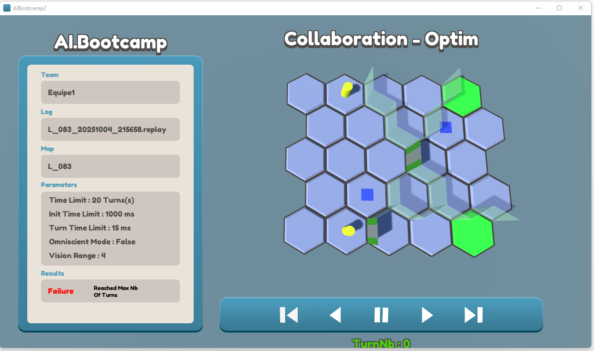
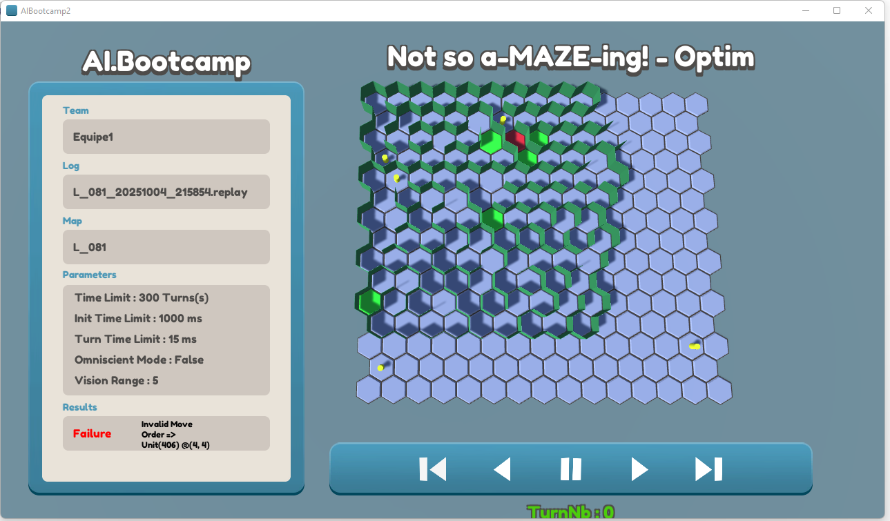
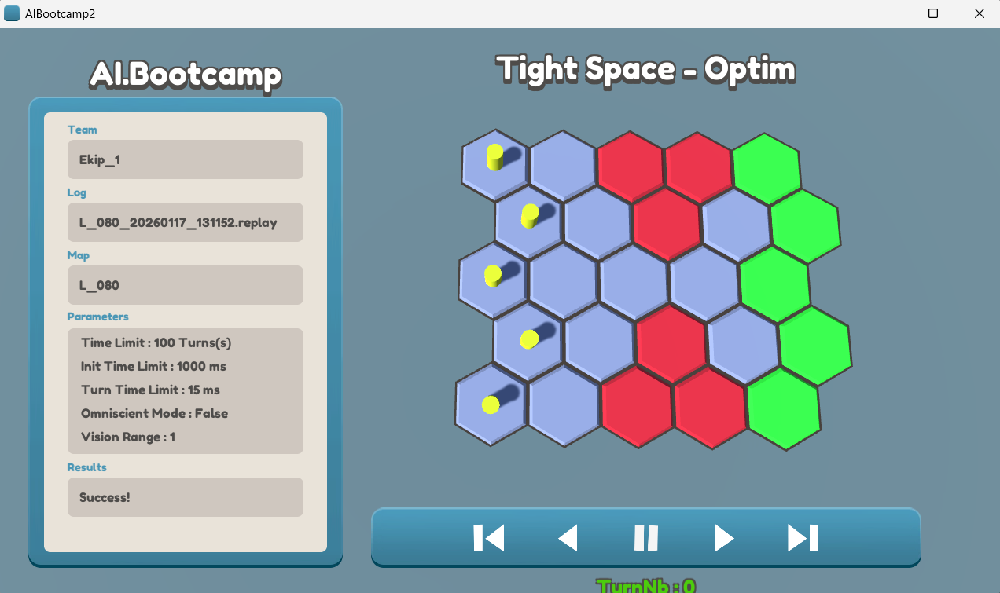
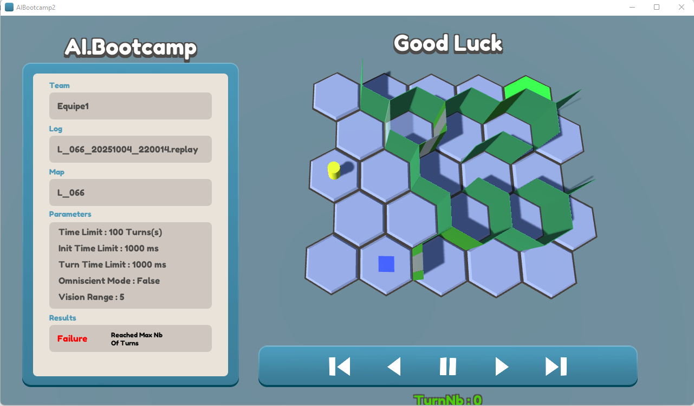
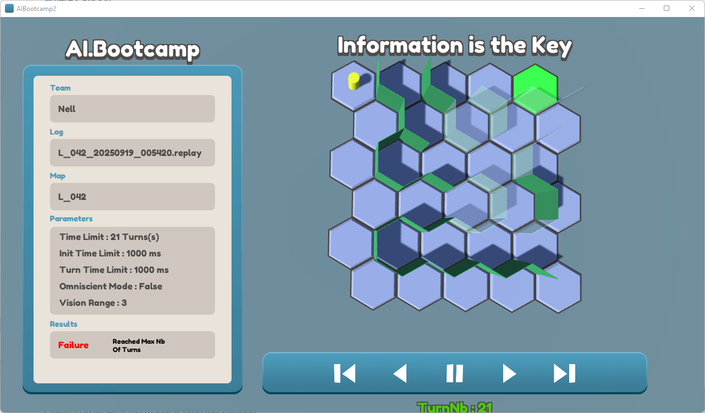

# AIBootcamp

[AIBootcamp](https://sites.google.com/view/aibootcamp/home) is a programming challenge created by [Carle Coté](https://www.linkedin.com/in/carlecote/). It is designed to learn, experiment with, and master both basic and advanced Game AI concepts through practical, game-oriented exercises.

[Click here for a detailed explaination of the challenge and our solution ](https://nelltruong.dev/projects/aibootcamp)

## Learnings

- Problem solving
- Pathfinding and path following
- Decision-making architectures
- State machines
- Utility-based scoring and evaluation
- Agent cooperation and collaboration
- Agent interactions
- Optimization

## Sample Levels

## Installation *(Developers Only)*

1. Download the project folder from Google Drive:  
   [AIBootCamp2 – Google Drive](https://drive.google.com/drive/folders/11AQeiiAxr0goOXfUqD1tQLMGNidyqx77)

2. Place the downloaded folder in the **root directory** of the project.